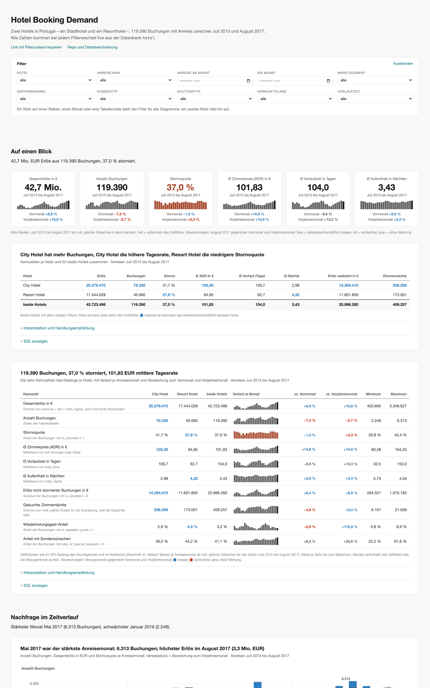

# Interaktives Dashboard

Live: **<https://hotel.butscher.cloud>** (eigener Server, antwortet sofort) und
**<https://hotel-dashboard-cuoi.onrender.com>** (Render, Free-Plan: nach 15
Minuten ohne Aufruf schläft der Dienst ein, der erste Aufruf danach dauert bis zu
einer Minute). Beide Instanzen bauen aus demselben Stand von `main`.

Das Dashboard liest bei jedem Filterwechsel live aus der Datenbank `hotel`
(Rolle `studi_hotel`) und zeigt dieselben Kennzahlen wie das Notebook und die
Power-BI-Referenzlösung. Es ist zugleich das Lehrbeispiel für die Arbeitsteilung
„Python liefert Zahlen als JSON, JavaScript zeichnet".



## Funktionen

| | |
|---|---|
| Auf einen Blick | sechs Kacheln (stornobereinigter Umsatz, gebuchter Umsatz, Buchungen, Stornoquote, Ø Zimmerpreis, Ø Aufenthalt) mit Mini-Säulen über alle Monate (gleiche Zeitachse, ab null) und der Abweichung des Bezugsmonats zum Vormonat und Vorjahresmonat — blau = betriebswirtschaftlich besser, rot = schlechter; Kennzahlentabelle mit den zehn Katalog-Kennzahlen je Hotel und für beide zusammen, Verlauf, Abweichungen, Minimum und Maximum |
| Zeitverlauf | Buchungen, stornobereinigter Umsatz und Stornoquote als Säulen **untereinander**, jedes Feld mit eigener Zeitachse; der Vorjahresmonat steht nach IBCS als graue Säule versetzt hinter der Ist-Säule, die Differenz trägt den Signalton (blau besser, rot schlechter); beschriftet sind erster Monat, Minimum, Maximum und Bezugsmonat; die Zeitachse trägt unter der letzten Säule immer Monat und Jahr |
| Vertrieb | je Marktsegment und je Vertriebskanal der Anteil an den Buchungen neben dem Anteil am Umsatz (gleiche Prozentskala, absolute Werte in Klammern); Marktsegment × Kundentyp als Tabelle mit Datenbalken, sortierbar und nach Hotel gruppierbar |
| Stornorisiko | Stornoquote nach Hotel, Kautionstyp, Marktsegment und Vorlaufzeit untereinander auf **einer Skala 0–100 %** mit Referenzlinie „insgesamt"; Umsatz und durch Stornierung entgangener Umsatz je Monat |
| Herkunft | die 15 größten Länder als Balken (übrige zusammengefasst), alle Länder als sortierbare, nach Hotel gruppierbare Tabelle mit Datenbalken und CSV-Export |
| Interaktion | Hover oder Tippen auf jede Säule, jeden Balken und jede Linie zeigt Wert, Abweichung zum Vormonat und Vorjahresmonat bzw. Anteil, Stornoquote und Abstand zur Gesamtquote; Klick setzt den Filter für alle Diagramme (Kreuzfilterung) |
| Filter | Hotel, Anreisejahr, Zeitraum (Monat ab/bis), Marktsegment, Vertriebskanal, Kundentyp, Kautionstyp, Land, Vorlaufzeit; aktive Filter als abwählbare Chips; der Zustand steht in der Adresse („Link mit Filterzustand kopieren"). Monate außerhalb des Zeitfilters bleiben hell sichtbar, damit Vormonat und Vorjahr vergleichbar bleiben |
| Texte | je Abschnitt ein Leitsatz; je Figur eine Aussage mit Zeitbezug, eine Beschreibung (Messgröße, Einheit, Zeitraum, Filter) und aufklappbar **Interpretation** und **Handlungsempfehlung**, aus den Daten formuliert; „SQL anzeigen" mit der Abfrage samt Parametern |
| Klarnamen | alle Kürzel des Datensatzes werden übersetzt (Marktsegmente, Kanäle, Kundentypen, Kautionstypen, Ländernamen aus ISO-3-Codes); Filter und SQL arbeiten weiter mit den Originalwerten |

Gegenüber der Power-BI-Lösung kommen hinzu: SQL-Anzeige, teilbarer Filterzustand,
Interpretation und Handlungsempfehlung je Figur, Vorjahres- und Vormonatsvergleich
mit Signalfarben, Gruppierung in Tabellen.

## Gestaltung

Nach Tufte, Few, Hichert (IBCS) und Bissantz:

* **Aussage zuerst:** Titel nennt den Befund mit Zeitbezug, die Beschreibung darunter Messgröße, Einheit, Zeitraum und Filter; nur zwei Textebenen (Datawrapper-Regel).
* **Gleiche Skalen, wo verglichen wird:** die vier Stornoquoten-Diagramme teilen eine Skala; Kennzahlen mit verschiedenen Einheiten stehen untereinander auf einer Zeitachse, nie nebeneinander (Bissantz: Kennzahlen untereinander).
* **Fluchten:** alle Balkendiagramme haben dieselbe Beschriftungsbreite, sodass Balken und Werte über die Seite hinweg in einer Linie stehen; eine Spalte, 32 px Abstand, 64 px zwischen Abschnitten.
* **Wenig Tinte ohne Daten:** keine Rahmen und Achsen, wo Werte am Balken stehen; Gitterlinien nur bei Zeitreihen; Linien enden mit ihrer Beschriftung statt in einer Legende.
* **Farbe als Werturteil (DeltaMaster-Logik von Bissantz):** Blau für Kennzahlen, die das Ergebnis verbessern (Umsatz, Buchungen, Zimmerpreis), Rot für Kennzahlen zu seinen Lasten (Stornoquote, entgangener Umsatz), Grau ohne Wertung (Vorlaufzeit, Sonderwünsche). Werte stehen in der aufgehellten Stufe, das volle Blau/Rot bleibt Abweichungen (besser/schlechter) und dem Bezugsmonat vorbehalten; Zahlen bleiben schwarz. Keine Farbe für „besseres Hotel" oder andere Vergleiche ohne Ergebniswirkung. Petrol markiert die aktive Auswahl.
* **Tabellen als grafische Tabellen:** Zahlen rechtsbündig, Datenbalken relativ zum Spaltenmaximum, Sparklines mit explizitem Minimum und Maximum, Gruppenzeilen mit Zwischensummen.
* **Telefon:** eine Spalte, kleinere Ränder, Tabellen zeigen die tragenden Spalten, der Rest ist rollbar.

Quellen: IBCS-SUCCESS-Regeln (Say, Unify, Condense, Check, Express, Simplify, Structure); Datawrapper, *What to consider when using text in data visualizations*; Few, *Common Pitfalls in Dashboard Design*; Bissantz, *Bella berät – 75 Regeln für bessere Visualisierung* und [Using business effects as color criteria](https://www.bissantz.de/en/know-how/clicks-en/using-business-effects-as-color-criteria/) (DeltaMaster: Blau = gut für das Geschäftsziel, Rot = schlecht, unabhängig vom mathematischen Vorzeichen).

## Lokal starten

```bash
cd dashboard
pip install -r requirements.txt
uvicorn backend.app.main:app --reload --port 8765
```

Dann <http://localhost:8765> öffnen. Die Datenbankadresse steht in
`backend/app/datenbank.py` (Rolle `studi_hotel`); `DATABASE_URL` in der
Umgebung überschreibt sie.

API-Tests (einschließlich lesender Abfragen gegen die Lehrdatenbank):

```bash
cd dashboard
python -m pytest
```

Die Filtervalidierung lässt sich auch ohne Datenbank testen:
`python -m pytest backend/tests/test_filter.py` im Ordner `dashboard/`.

Frontend-Regressionstests (Node.js ab Version 20):

```bash
cd dashboard
npm ci
npm test
```

Diese Tests verwenden die gleichen D3-/Plot-Versionen wie die Webseite und
prüfen die Darstellung in einem DOM, schnelle Filterwechsel, leere Ergebnisse
und die Behandlung von URL-Inhalten. Node.js wird nur für Tests benötigt.

Als Container:

```bash
cd dashboard
docker build -t hotel-dashboard .
docker run -p 8765:8000 hotel-dashboard
```

## Aufbau

| Pfad | Inhalt |
|---|---|
| `backend/app/datenbank.py` | Verbindung (SQLAlchemy, kleiner Pool), `abfragen(sql, parameter)` |
| `backend/app/filter.py` | der Filterzustand und `where_klausel()`, die daraus eine parametrisierte WHERE-Bedingung baut |
| `backend/app/abfragen.py` | je Kennzahlblock und Diagramm eine Funktion mit ihrem SQL |
| `backend/app/main.py` | FastAPI-Routen unter `/api/…`, `/health`, statisches Frontend |
| `backend/tests/test_abfragen.py` | Kontrollwerte und Routen |
| `frontend/index.html`, `style.css` | Seite und Gestaltung |
| `frontend/bezeichnungen.js`, `laendernamen.js` | Klarnamen für Kürzel und ISO-3-Ländercodes |
| `frontend/app.js` | Filterzustand, Adresse, Laden, Datenaufbereitung, Abschnitte |
| `frontend/diagramme.js` | ein Diagramm je Funktion mit Observable Plot (Balken mit Führungslinien, Balkenpaar, Säulen mit Versatzstück, gestapelte Säulen, Mini-Säulen) |
| `frontend/tabelle.js` | sortierbare, gruppierbare Tabelle mit Datenbalken |
| `frontend/texte.js` | Leitsätze, Aussagen, Interpretationen und Handlungsempfehlungen aus den Daten |
| `frontend/format.js` | deutsche Zahlen- und Monatsformate |
| `Dockerfile`, `../render.yaml` | Container und Render-Blueprint |

### Routen

Alle Routen nehmen dieselben Filterparameter entgegen, z. B.
`/api/kennzahlen?hotel=City%20Hotel&jahr=2016&segment=Online%20TA`, und
antworten mit `{"daten": [...], "sql": "...", "parameter": {...}}`.

| Route | Inhalt |
|---|---|
| `/api/filterwerte` | Ausprägungen aller Dimensionen mit Anzahl Buchungen (für die Auswahllisten) |
| `/api/kennzahlen` | die zehn Kennzahlen des Katalogs, eine Zeile |
| `/api/monate` | Kennzahlen je Anreisemonat und Hotel |
| `/api/hotels`, `/api/segmente`, `/api/kanaele`, `/api/kautionen`, `/api/laender` | Kennzahlen je Ausprägung der Dimension |
| `/api/laender_hotel` | Kennzahlen je Herkunftsland und Hotel (Gruppierung der Tabelle) |
| `/api/vorlaufzeit` | Kennzahlen je Vorlaufzeit-Bucket (0-7, 8-30, 31-90, 90+ Tage) |
| `/api/segment_kundentyp` | Anzahl Buchungen je Marktsegment, Kundentyp und Hotel |
| `/api/erloes_datum` | Erlös je Monat nach Anreisedatum und nach Datum des Reservierungsstatus |

Filterparameter: `hotel`, `jahr`, `von`, `bis` (Monate als `JJJJ-MM`), `segment`,
`kanal`, `kundentyp`, `kaution`, `land` (ISO-3), `vorlaufzeit`. Zeitfilter gelten
für das Anreisedatum; in `/api/erloes_datum` gilt der Zeitfilter der zweiten
Reihe für das Statusdatum.
Ungültige Jahres- und Monatsangaben sowie umgekehrte Zeiträume liefern HTTP 422.
Leere Filterwerte werden ignoriert. Umsatzsummen ohne passende Buchungen sind
0; Mittelwerte und Quoten ohne Beobachtungen bleiben leer.

## Deploy auf Render

`render.yaml` im Repo-Root beschreibt den Web Service `hotel-dashboard`
(Docker-Runtime, `rootDir: dashboard`, Free-Plan, Health-Check `/health`).
Eingerichtet am 12.09.2026 als Blueprint „hotel" im Render-Konto; jeder Push
auf `main` baut neu. Für eine eigene Instanz: auf render.com *New → Blueprint*,
Repo verbinden, *Deploy Blueprint*.

## Deploy auf dem eigenen Server

Dieselbe Anwendung läuft zusätzlich als Docker-Container auf einem eigenen VPS
hinter dem Reverse-Proxy Traefik, der das TLS-Zertifikat von Let's Encrypt holt.
Auf dem Server liegen unter `/root/hotel-dashboard/` eine `docker-compose.yml`
(baut `src/dashboard/Dockerfile`, Traefik-Labels für `hotel.butscher.cloud`,
Weiterleitung von HTTP auf HTTPS), ein Klon dieses Repos in `src/` und das
Skript `update.sh`. Ein Cron-Eintrag ruft `update.sh` alle zehn Minuten auf;
das Skript holt `main` und baut den Container nur, wenn sich der Stand geändert
hat (`update.sh --force` erzwingt den Neubau). Ein Push auf `main` ist damit
nach höchstens zehn Minuten plus Bauzeit online. `DATABASE_URL` ist nicht
gesetzt, der Container nutzt wie auf Render den Rückfall auf die Rolle
`studi_hotel`.

## Hinweise

* Datenquelle: Nuno Antonio, Ana de Almeida und Luis Nunes, *Hotel booking
  demand datasets*, Data in Brief, Band 22, Februar 2019 (CC BY 4.0); vollständige
  Angabe im README des Repos.
* Ländercodes wie im Datensatz (ISO 3166-1 alpha-3); „CN" steht dort für
  China, „UNK" für unbekannt.
* Die Datenbankverbindung ist unverschlüsselt (siehe
  `../docs/Supabase_Setup_VPS.md`); der Zugang ist lesend und die Daten sind
  öffentlich.

## Begriffe

**Stornobereinigter Umsatz** (in Texten kurz: Umsatz) = Zimmerpreis (ADR) × Nächte je
Buchung, nur Übernachtung, für nicht stornierte Buchungen (Spalte `revenue` der
Faktentabelle, `is_canceled = 0`).
**Gebuchter Umsatz** = derselbe Wert über alle Buchungen vor Stornierung.
**Durch Stornierung entgangener Umsatz** = Differenz der beiden. In der
Hotellerie heißt diese Größe Logisumsatz; für die Vorlesung gilt der
allgemeinere Begriff Umsatz. Eine Auslastung oder ein RevPAR ist nicht
berechenbar, weil der Datensatz keine Zimmerkapazität enthält.
