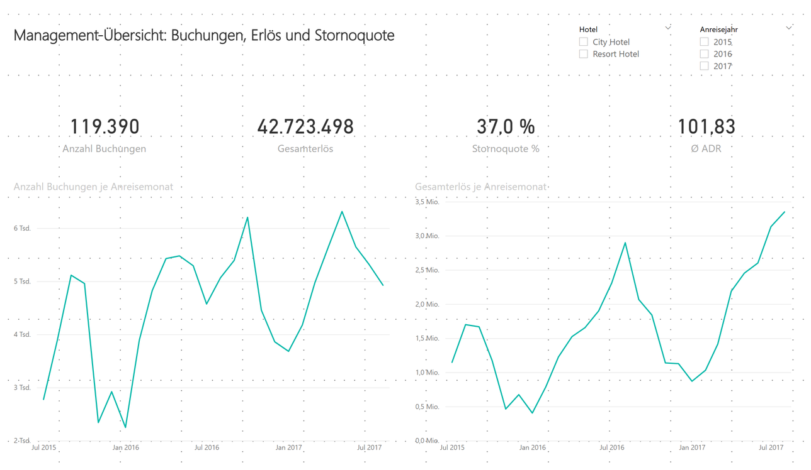
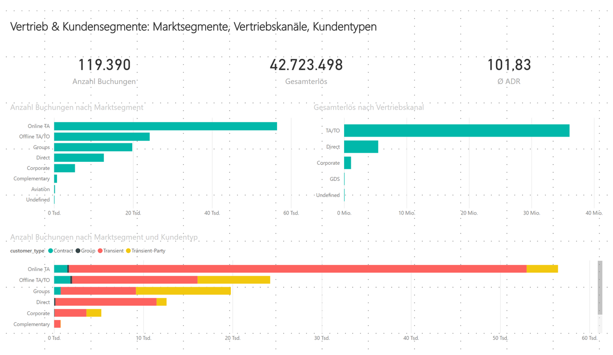
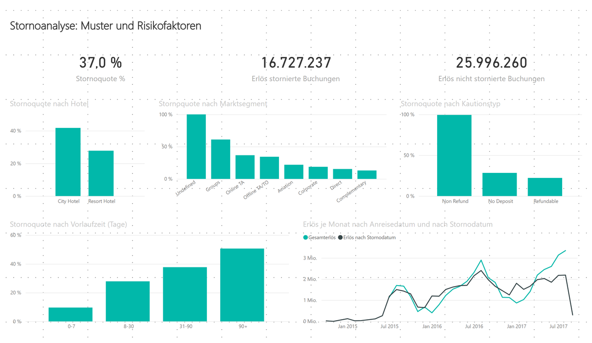
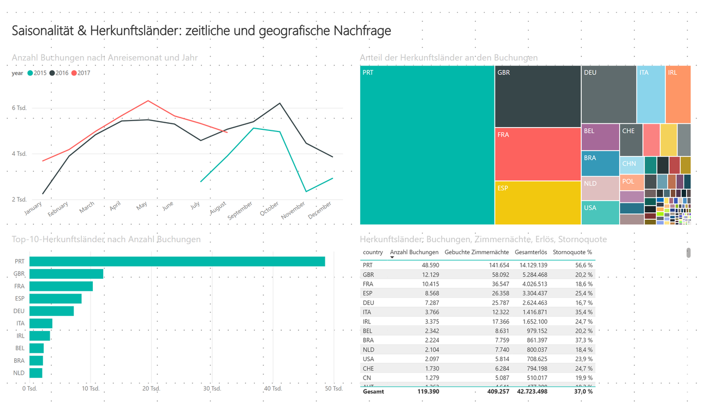

# Power-BI-Referenzlösung

Dieser Ordner enthält den Power-BI-Report, den das Grundgerüst der Vorlesung
beschreibt: Sternschema aus der Datenbank `hotel`, der KPI-Katalog als
DAX-Measures und die vier Report-Seiten. Studierende bauen den Report nach dem
Grundgerüst selbst auf und vergleichen ihr Ergebnis mit dieser Lösung.

Geprüft mit Power BI Desktop 2.152 (März 2026).

> **Stand 12.09.2026:** Die Measures im Projekt (`Hotel.pbip`) heißen Umsatz,
> Gebuchter Umsatz und Durch Stornierung entgangener Umsatz. `Hotel.pbix` trägt
> noch die früheren Namen (Gesamterlös, Erlös …); die Pflege der PBIX übernimmt
> Robert selbst.

## Öffnen

**`Hotel.pbix`** — Doppelklick. Die Datei enthält die Daten (Stand 12.09.2026),
es ist keine Verbindung zur Datenbank nötig.

**Aktualisieren** (nur, wenn die Daten neu aus der Datenbank geladen werden
sollen): *Start → Aktualisieren*. Beim ersten Mal fragt Power BI nach
Zugangsdaten:

1. Links *Datenbank* wählen, Benutzername `studi_hotel`, Kennwort `thws`,
   *Verbinden*.
2. Es folgt der Dialog *Verschlüsselungsunterstützung* („Die
   Verbindungsherstellung mit der Datenquelle über eine verschlüsselte
   Verbindung war nicht möglich"): mit *OK* bestätigen. Die Instanz hat kein
   SSL-Zertifikat, siehe `../docs/Supabase_Setup_VPS.md`.

Power BI merkt sich beide Angaben je Rechner.

**`Hotel.pbip`** — dieselbe Lösung als Power-BI-Projekt: lauter Textdateien,
die sich lesen, vergleichen und versionieren lassen. Öffnen über *Datei →
Öffnen → Hotel.pbip*; danach *Aktualisieren* wie oben, weil das Projekt keine
Daten enthält.

| Pfad | Inhalt |
|---|---|
| `Hotel.SemanticModel/definition/tables/*.tmdl` | je Tabelle: Spalten, Power-Query-Abfrage, bei `FACT_BOOKINGS` alle Measures und die berechneten Spalten |
| `Hotel.SemanticModel/definition/relationships.tmdl` | die neun Beziehungen |
| `Hotel.Report/definition/pages/*/visuals/*/visual.json` | je Visual: Typ, Felder, Titel, Sortierung, Filter |

## Modell

Neun Tabellen aus `hotel_bi` im Import-Modus, Namen in Großschreibung wie im
Grundgerüst (`FACT_BOOKINGS`, `DIM_DATE`, …). Beziehungen 1:n von jeder
Dimension zur Faktentabelle, Filterrichtung einfach; `DIM_DATE` zweimal:

| Beziehung | Zustand |
|---|---|
| `FACT_BOOKINGS[arrival_date_key]` → `DIM_DATE[date_key]` | aktiv |
| `FACT_BOOKINGS[reservation_status_date_key]` → `DIM_DATE[date_key]` | inaktiv, genutzt in *Gebuchter Umsatz nach Stornodatum* über `USERELATIONSHIP` |

`DIM_DATE` ist als Datumstabelle markiert (`full_date`); automatische
Datumstabellen sind abgeschaltet. `month_name` ist nach `month` sortiert.

**Measures** (in `FACT_BOOKINGS`, Formeln wortgleich aus dem Katalog):
Anzahl Buchungen · Stornoquote % · Ø Vorlaufzeit · Ø Aufenthaltsdauer ·
Gebuchte Zimmernächte · Ø ADR · Gebuchter Umsatz · Umsatz · Durch Stornierung
entgangener Umsatz · Wiederholungsgast-Anteil % · Anteil mit Sonderwünschen % ·
Gebuchter Umsatz nach Stornodatum · Ø gebuchter Umsatz je Buchung.

**Begriffe:** Umsatz = Zimmerpreis (ADR) × Nächte je Buchung, nur Übernachtung,
für nicht stornierte Buchungen; gebuchter Umsatz = alle Buchungen vor
Stornierung; durch Stornierung entgangener Umsatz = Differenz.

**Berechnete Spalten:** `FACT_BOOKINGS[Lead-Time-Bucket]` (0-7, 8-30, 31-90,
90+ Tage) mit verborgener Sortierspalte; `DIM_DATE[Monat]` (erster Tag des
Monats, für Zeitachsen); `DIM_DATE[Wochentag Nr]` (verborgen, sortiert
`weekday_name`).

**Zwei Abweichungen von der Datenbank:** `is_canceled` und
`is_repeated_guest` sind in Postgres Boolean und werden in Power Query auf
0/1 gewandelt, damit die Katalogformeln (`= 1`) unverändert gelten. Die
Fremdschlüsselspalten der Faktentabelle sind in der Berichtsansicht
ausgeblendet; in der Modellansicht sind sie sichtbar.

## Seiten

**1 Management-Übersicht** — Karten Anzahl Buchungen, Gebuchter Umsatz,
Stornoquote %, Ø ADR; zwei Liniendiagramme je Anreisemonat; Slicer Hotel und
Anreisejahr (2015–2017).

**2 Vertrieb & Kundensegmente** — Buchungen nach Marktsegment, gebuchter Umsatz
nach Vertriebskanal, gestapelt Marktsegment × Kundentyp.

**3 Stornoanalyse** — Stornoquote nach Hotel, Marktsegment, Kautionstyp und
Vorlaufzeit; Karten Umsatz / durch Stornierung entgangener Umsatz; Liniendiagramm
*Gebuchter Umsatz je Monat nach Anreisedatum und nach Stornodatum* — dasselbe Maß über die aktive
und über die inaktive Beziehung.

**4 Saisonalität & Herkunftsländer** — Buchungen je Anreisemonat und Jahr,
Treemap der Herkunftsländer, Top-10-Länder (Top-N-Filter auf dem Visual),
Tabelle mit Buchungen, Zimmernächten, gebuchtem Umsatz und Stornoquote je Land.

**Kartenvisual:** Das Grundgerüst nennt für Seite 4 eine Choroplethenkarte.
In Power BI Desktop sind die klassischen Karten (Bing) standardmäßig
deaktiviert, und das Azure-Maps-Visual verlangt eine Anmeldung mit einem
Microsoft-Konto. Die Referenzlösung verwendet deshalb eine Treemap; wer
angemeldet ist, kann sie durch *Azure Maps* mit `DIM_COUNTRY[country]` als
Standort ersetzen (die Spalte ist als Datenkategorie *Land* markiert).

## Kontrollwerte

Ohne Filter müssen die Karten zeigen: Anzahl Buchungen 119.390, Stornoquote
37,0 %, Ø ADR 101,83, Gebuchter Umsatz 42.723.498, Umsatz 25.996.260, Durch
Stornierung entgangener Umsatz 16.727.237. Dieselben Werte liefert das
Notebook in Abschnitt 4.
